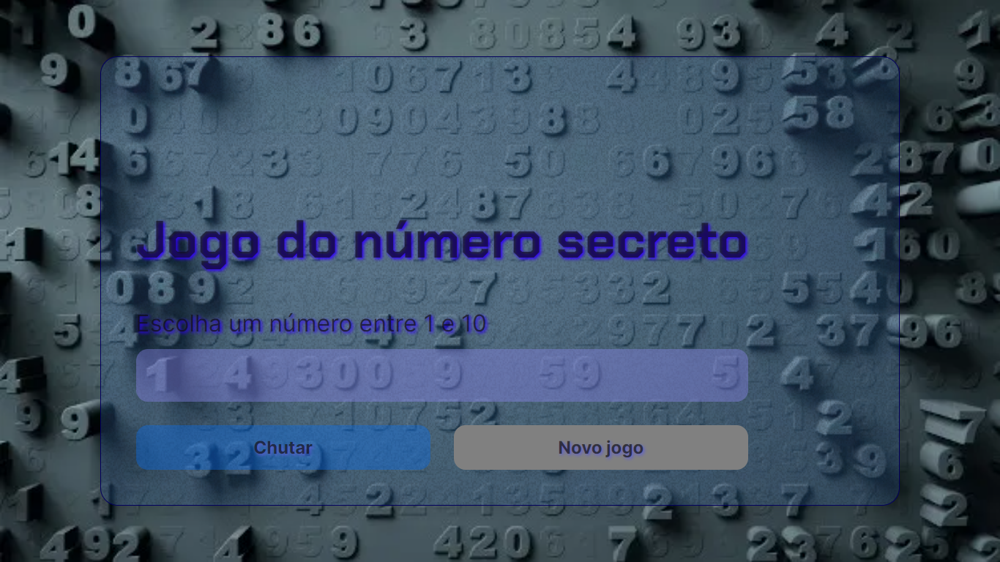
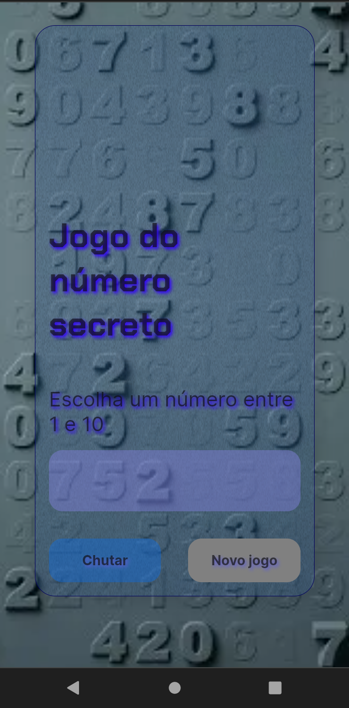

## 🌐 Apresentação 
Apresento a vocês um jogo de adivinhação, projeto realizado nas aulas práticas da instituição de ensino Alura.

## 🎮 Funcionalidades
Para jogar, você precisa colocar o número na caixinha de texto e clicar no botão `Chutar`. Ao adivinhar o número, clique no botão `Novo Jogo` para jogar novamente.

## 🚀 Tecnologias
`HTML` `JavaScript` `CSS`

## 📱💻 Site Responsivo

| Desktop                           | Móvel                            |
| ----------------------------------| ---------------------------------|
|  |  |

